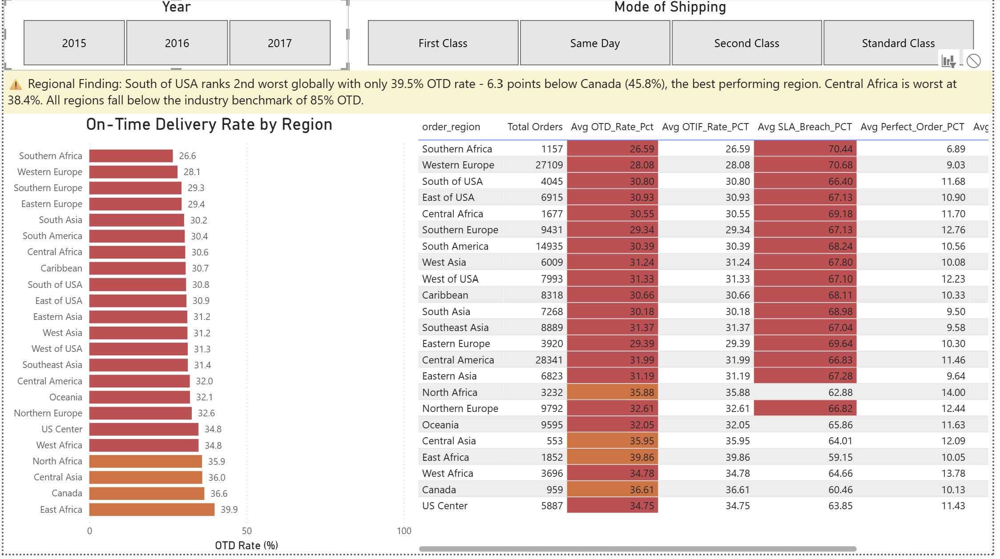
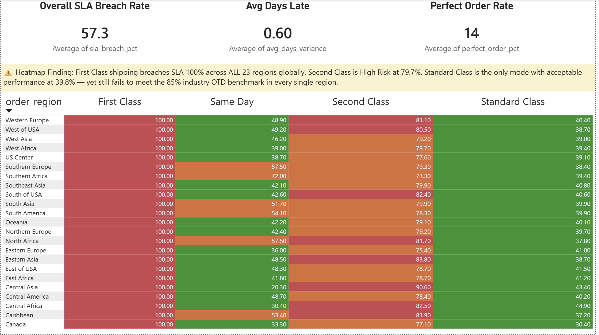
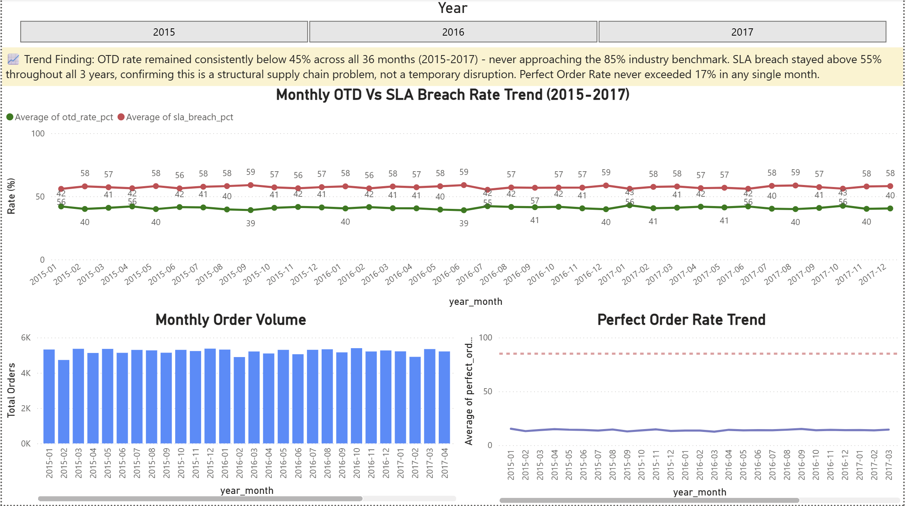

# Supply Chain & Logistics Performance Dashboard

<div align="center">


### Excel → Python → SQL Server → Power BI
*An end-to-end analytics project built to uncover delivery failures, quantify SLA breaches, and surface operational bottlenecks across $36.8M in orders.*

</div>

---

## Overview

This project turns a raw supply chain dataset into a polished analytics workflow. It combines Excel-based data checks, Python feature engineering and EDA, SQL Server dimensional modeling, and a 4-page Power BI dashboard.

The goal was simple: identify where delivery performance was failing, measure the impact, and provide decision-makers with a single source of truth.

---

## Business Problem

> A global e-commerce company is losing customer trust, but the team does not know exactly where the delivery process is breaking down.

The operational questions were:

- Are orders arriving on time?
- Are they arriving complete?
- Which regions are underperforming?
- Which shipping modes justify their cost?

Without a consolidated view, every improvement effort was based on guesswork.

---

## What I Built

I built an end-to-end pipeline that moves from raw CSV data to a production-style analytics model and dashboard.

```text
Raw CSV (180,519 rows, 53 columns)
        ↓
  Excel          Schema audit · null checks · pivot discovery
        ↓
  Python         KPI flag engineering · EDA · clean data export
        ↓
  SQL Server     Star schema · KPI views · SLA breach analysis
        ↓
  Power BI       4-page interactive dashboard with drill-down slicers
```

---

## Key Findings

| # | Finding | Business Impact |
|---|---|---|
| 1 | First Class shipping has a 100% SLA breach rate across all 23 regions | Premium shipping is delivering the worst experience |
| 2 | Overall OTD rate is 40.9% versus an 85%+ benchmark | Less than half of shipments arrive on time |
| 3 | South of USA is among the weakest regions at 39.5% OTD | Regional bottlenecks are clearly visible |
| 4 | Perfect Order Rate is only 14% | Most orders fail at least one delivery dimension |
| 5 | OTD stays below 45% across 36 months | The issue is structural, not temporary |

---

## Dashboard Gallery

### Executive Summary


This page provides the top-line KPI view: OTD, OTIF, SLA breach, perfect order rate, revenue, profit, and average shipping time.

### Regional Analysis



This page ranks all 23 regions and highlights the most affected geographies using slicers for year and shipping mode.

### SLA Heatmap



This page shows where regional performance breaks down by combining region and shipping mode into a single heatmap.

### Trend Analysis



This page tracks performance over time and confirms that there has been no meaningful improvement across the 3-year period.

---

## Python EDA Gallery

### Delivery Performance by Shipping Mode

![Delivery Performance by Shipping Mode] ]

The first chart compares delivery risk by shipping mode and shows why First Class stands out as the weakest option.

### On-Time Delivery Rate by Region


The regional view shows a tight cluster of low OTD performance, with no region approaching the expected benchmark.

### SLA Breach Heatmap


This cross-tab visualization helped reveal the combined region and shipping-mode failure pattern before the SQL layer was built.

---

## Technical Architecture

### Star Schema

```text
                      DIM_Date
                         │
DIM_Customer ──── FACT_Orders (180,519 rows) ──── DIM_Shipping
                         │
               DIM_Region   DIM_Product
                         │
                    DIM_Geography
```

### KPI Engineering in Python

```python
# Binary flags engineered as new columns
is_on_time       = delivery_status in ['Advance shipping', 'Shipping on time']
is_complete      = order_status == 'COMPLETE'
is_sla_breach    = days_shipping_real > days_shipping_scheduled
is_otif          = is_on_time and is_qty_fulfilled
is_perfect_order = is_on_time and is_complete and not is_sla_breach
days_variance    = days_shipping_real - days_shipping_scheduled
```

### SQL KPI Views

```sql
VW_KPI_Summary           -- Overall KPI scorecards
VW_KPI_By_ShippingMode   -- Performance by shipping mode
VW_KPI_By_Region         -- Regional breakdown with slicers
VW_SLA_Heatmap           -- Region x mode matrix
VW_Monthly_Trend         -- 36-month time series
VW_KPI_By_Category       -- Product category performance
```

---

## KPI Definitions

| KPI | Definition | Result | Benchmark |
|---|---|---:|---:|
| OTD | % of orders delivered on time | 40.9% | 85%+ |
| OTIF | % on time and complete quantity | 40.9% | 90%+ |
| SLA Breach | % of shipments exceeding promised days | 57.3% | <15% |
| Perfect Order | On-time, complete, and accurate | 14.0% | 80%+ |
| Fill Rate | % of order quantity fulfilled immediately | 100% | 95%+ |
| Avg Days to Ship | Average actual shipping days | 3.5 days | 2-3 days |
| Days Variance | Actual minus promised shipping days | +0.6 days | <=0 |

---

## Business Recommendations

1. Reassess First Class SLA commitments. A 100% breach rate suggests the promised delivery window is not achievable.
2. Prioritize South of USA and Central Africa. These regions sit below 40% OTD and represent high-impact intervention points.
3. Study the Standard Class operating pattern. It is still imperfect, but it performs best relative to the other shipping modes.
4. Treat the problem as structural. The flat 36-month trend indicates that tactical fixes alone are not enough.

---

## Project Structure

```text
supply-chain-logistics-dashboard/
│
├── Excel/
│   └── Working_Data.csv
│
├── Python/
│   ├── Supply chain - Data Cleaning and EDA.ipynb
│   ├── plot1_delay_by_shipmode.png
│   ├── plot2_delay_by_region.png
│   └── plot3_sla_breach_heatmap.png
│
├── SQL/
│   ├── 01_create_database.sql
│   ├── 02_staging_table.sql
│   ├── 03_bulk_insert.sql
│   ├── 04_dimension_tables.sql
│   ├── 05_fact_table.sql
│   ├── 06_rebuild_dim_region.sql
│   ├── 07_validation.sql
│   ├── 08_kpi_views.sql
│   ├── 09_view_verification.sql
│   └── 10_fix_dim_shipping_join.sql
│
├── Power BI file/
│   └── Supply_chain_Dashboard.pbix
│
├── Screenshots/
│   ├── page1_executive_summary.png
│   ├── page2_regional_analysis.png
│   ├── page3_sla_heatmap.png
│   └── page4_trend_analysis.png
│
└── README.md
```

---

## Tech Stack

| Tool | Purpose |
|---|---|
| Microsoft Excel | Data audit, null checks, pivot validation |
| Python 3.12 with pandas, seaborn, matplotlib, scipy | Cleaning, KPI engineering, EDA |
| SQL Server Express with T-SQL | Star schema, dimensional modeling, KPI views |
| SSMS 22 | Query development and schema management |
| Power BI Desktop with DAX | Interactive dashboarding |

---

## How to Reproduce

Prerequisites: SQL Server Express, Python 3.8+, Power BI Desktop, and the DataCo dataset from Kaggle.

1. Run the SQL scripts in order from 01 to 10 in SSMS.
2. Open the Python notebook: [Python/Supply chain - Data Cleaning and EDA.ipynb](Python/Supply%20chain%20-%20Data%20Cleaning%20and%20EDA.ipynb).
3. Open the Power BI file and update the SQL Server connection string to match your local environment.

---

<div align="center">

End-to-end analytics pipeline built on a real-world supply chain dataset.

</div>
